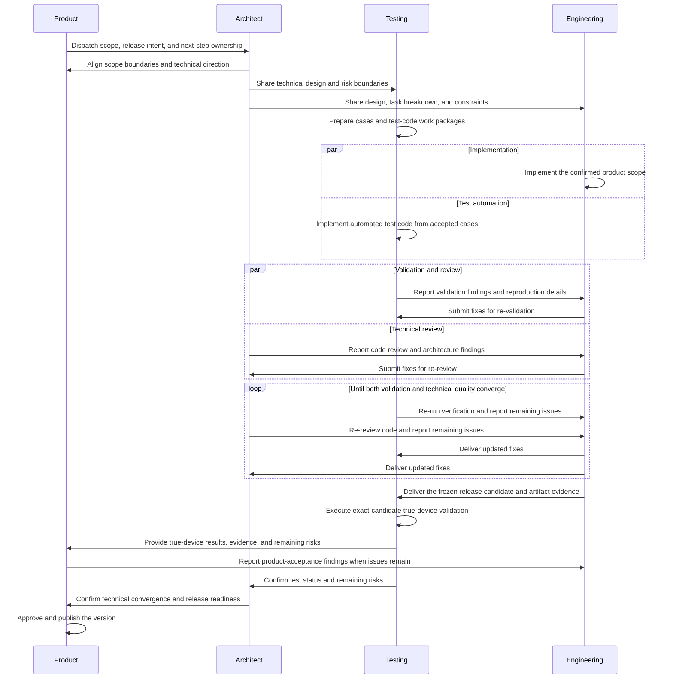

# Role Collaboration Flow

This document defines how the Product, Architect, Engineering, and Testing roles collaborate on a
MarkHola version change.

## 1. Roles

- Product — owns version scope, cross-role orchestration, and release publication
- Architect — owns technical design, technical review, and final code-quality convergence
- Engineering — owns implementation and fixes
- Testing — owns test coverage, automated test code, validation execution, true-device testing, and
  re-validation

## 2. Session model

Each role should operate in its own dedicated session. Do not mix multiple primary roles into the
same session when the intent is role-based collaboration.

Required session-to-role mapping:

- one Product session
- one Architect session
- one Engineering session
- one Testing session

Session names must stay explicitly associated with the role. Use role-first naming such as:

- `product`
- `architect`
- `engineering`
- `testing`

When multiple sessions of the same role are needed, keep the role prefix and add a scoped suffix,
for example:

- `architect-v1.0.0`
- `engineering-editor`
- `testing-release-v0.8.2`

For concurrent Engineering sessions, prefer responsibility-oriented names such as
`engineering-release-candidate` and `engineering-universal-audit` so ownership is visible from the
session list. Use `engineering-1`, `engineering-2`, and similar numeric suffixes only when the work
cannot be summarized with a stable scope name.

When test-code implementation and true-device validation can proceed independently, Architect
should split them into clearly named sessions such as `testing-unit-cases` and
`testing-device-validation`. Test-code sessions own only test files and fixtures; true-device
sessions own the exact-candidate manual evidence. Both report confirmed defects directly to the
Engineering session that owns the affected work package.

Testing is the single owner of the ignored local `bugs/` ledger. Every finding receives a stable
`MH-BUG-<UUID>` identifier and retains reproduction steps, expected and actual behavior, candidate
identity, evidence, owner, implementation status, fix commit, re-test result, and regression
coverage. Engineering sends status and fix handoffs directly to Testing rather than editing the
ledger concurrently. Rejected and duplicate findings remain recorded for later regression and
retrospective analysis.

When multiple Testing sessions run concurrently, use a dedicated `testing-bug-triage` session as
the sole ledger writer. Other Testing sessions deliver findings and re-test evidence to that
session and keep their own write scopes limited to test code or device evidence.

After the team explicitly decides to start development for a version, and Product confirms the paired
design, test plan, and example direction, the roles may establish one explicit scope-freeze commit
before implementation starts. The commit must be small, independently understandable, and limited to
confirmed tracked planning or version metadata
within the owner's write scope. Ignored drafts, implementation code, test code, fixtures, artifacts,
and unresolved scope changes remain excluded. This freeze commit is separate from subsequent feature
packages and does not authorize Release mutation; if Product governance keeps `PLAN.MD` unstaged,
the freeze remains a handoff state until the user authorizes that Product commit.

Full GUI validation must not take control of the user's active desktop. Run it in an isolated
macOS VM, a dedicated Mac runner, or an explicit host-idle validation window provided by the user.
Docker and non-macOS CI may execute headless tests and static gates but cannot produce release
evidence for AppKit, WKWebView, PDFKit, DMG behavior, Rosetta, or Intel-native execution.

Architect should actively assess whether the confirmed work can be split into independent packages
that run concurrently. Use additional role-scoped sessions when parallel execution materially
shortens the critical path, but define one owner, a disjoint write scope, acceptance criteria, and
an integration point for every package. Do not parallelize a tightly coupled chain when concurrent
changes could conflict or invalidate shared evidence; release-candidate assembly, signing,
packaging, and artifact freezing should normally retain one owner.

Each parallel Engineering or Testing package should run in a temporary, feature-scoped session or
subagent with only the minimum context required for that package. Do not reuse a completed package's
session for unrelated work or carry unrelated history into a new package. Once the commit or evidence
is delivered and consumed, close the temporary session or subagent so stale context and idle work do
not remain active.

Session closeout must include a concise lessons-learned pass. Preserve only lessons that are accurate,
verified, broadly reusable, and significant enough to change future decisions or validation. Prefer
the smallest appropriate role or workflow document; do not store routine status, duplicate handoffs,
speculative ideas, or one-off debugging detail. If no durable lesson meets that bar, close the session
without adding shared knowledge.

The role identity of a session should remain stable throughout the work. Do not silently switch a
session from one primary role to another.

The Product session is the default coordinator for the role sessions. Product decides which role
session should act next and when work should be handed off across roles. Use the dispatch rules in
`docs/role-sessions.md` when deciding the next session.

Product continuously maintains the current phase, critical path, package owner, next action,
dependencies and blockers, acceptance exit, and last substantive progress. It actively detects
ownerless work, missing next actions, waiting confirmations, unconsumed handoffs, fixes awaiting
re-test, and unclosed phase exits. When the next owner and action are clear, Product drives them
immediately instead of waiting for the user.

Blocking confirmations use a default 10-minute follow-up. Other work that exceeds a reasonable
expected duration should trigger a direct status check and, when useful, re-routing, safe parallel
decomposition, or escalation to the user. Product must preserve role boundaries: project management
does not authorize Product to implement, test, or perform Architect review. Routine healthy
progress remains low-noise; Product reports substantive progress, risks, decisions, or blockers
requiring user intervention.

All cross-session messages must include a UUID message ID as defined in `docs/role-sessions.md`.
Role sessions should use that message ID as the primary deduplication key.

If a rule or coordination notice applies to every role session, deliver it directly to every mapped
role session except the sender.

Cross-session delivery is direct-first. Product, Architect, Engineering, and Testing use direct
session messaging to wake the target immediately and do not run independent IM polling watchers.
Resolve current role sessions through Codex thread discovery.

Do not run an IM Proxy or append new coordination messages to IM. If direct delivery fails, refresh
the target session and retry with the same UUID. If the target still cannot be reached, report the
delivery blocker in the sender's task. Delivery success proves receipt, so replies should report
only a decision, blocker, completed result, or actionable handoff.

When Product hands off a scope change, the handoff must preserve the smallest confirmed
interpretation of the user's request. Do not silently widen a feedback item from one scenario into
multiple scenarios, or from one UI surface into a whole feature, unless Product explicitly says to
broaden the change.

When the requested work changes implementation behavior, Product should hand the corrected scope to
Architect first. Product should not bypass Architect and directly instruct Engineering on product
scope corrections, unless Architect has already confirmed the same implementation boundaries and
Product is only restating them to remove ambiguity.

When any role is blocked on a pending scope confirmation that is required before the next stage can
continue, that role should proactively follow up instead of waiting indefinitely. As a default
workflow rule, send one reminder after 10 minutes without a reply, then continue at a low reminder
frequency until the blocked confirmation is resolved or the task direction changes.

When any role already has a clear next owner, next action, and no unresolved blocker, that role
should continue the workflow immediately instead of stopping after only acknowledging the message.
Do not treat a pure receipt reply as sufficient progress when review, implementation, validation,
handoff, or acceptance work is already ready to continue.

When a role is running a bounded submission-readiness or release-preparation pass, it should try to
complete that pass before reporting back, then return one consolidated blocker summary instead of
multiple fragmented blocker messages whenever practical.

Every completed result or handoff must be consumed by its downstream owner. Product keeps the
handoff on the critical path until the next action has started or the relevant phase exit is closed;
a receipt-only state is not progress.

Before any role sends a coordination message, it should process all currently delivered relevant
messages. After sending, it should continue immediately when the next step is already clear instead
of waiting for another communication cycle.

Role details live in:

- `docs/roles/product.md`
- `docs/roles/architect.md`
- `docs/roles/engineering.md`
- `docs/roles/testing.md`
- `docs/role-sessions.md`

## 3. Sequence overview

## 4. Standard flow

### Step 1 — Product plans the version

The Product role defines the version goal, priority, and scope in `PLAN.MD`, then hands the
version task to the Architect.

### Step 2 — Product and Architect align on the solution direction

The Architect reviews the requested scope with Product, identifies technical constraints, and
prepares the technical design document. As part of the implementation decomposition, Architect
records which packages can run concurrently, their owners and write scopes, and which critical-path
operations must remain single-owner.

If Product, Architect, Engineering, or Testing is waiting on a confirmation that blocks the next
step in this sequence, the waiting role should re-ping the owner of that confirmation rather than
stalling silently.

### Step 3 — Testing prepares validation coverage

Testing waits for the Architect handoff, then uses the version plan and the technical design
document to prepare the testing design and validation coverage:

- test-plan design
- test cases
- regression coverage
- true-device validation cases
- release-relevant verification cases when applicable
- automated unit, integration, or script-level test-code tasks

Product also provides important-scenario UX expectations and key-scenario HTML design direction
when the change needs explicit HTML prototype or brand guidance.

### Step 4 — Engineering implements the work

Engineering starts implementation according to the approved technical design and keeps the work
within the confirmed version scope.

### Step 5 — Architect reviews the implementation direction

As implementation becomes available, the Architect reviews code quality and gives improvement
feedback on:

- architecture layering
- module structure
- design patterns
- extensibility
- performance
- compatibility

The Architect must also review repository discoverability and structural maintainability, including
whether related capability files are coherently grouped by responsibility. Filename prefixes and
sibling clusters are review signals, not automatic refactor instructions. When related files appear
scattered, Architect first inventories their responsibilities, dependencies, platform conditions,
test ownership, and resource paths. A directory or module consolidation is recommended only when it
improves cohesion and discoverability without broadening visibility, creating cycles, breaking
ownership, or mixing unrelated behavior.

Approved structural moves require a small blueprint, explicit owner/write set, validation plan, and
separate integration boundary. A purely cosmetic rename or move should be rejected or deferred.

Repeat this structural pass after each small implementation package. Review only the affected
responsibility clusters, record either the current structure or a bounded follow-up refactor, and do
not postpone all structure work until the end of a version.

If the review input is already sufficient, the Architect should continue the review directly rather
than pausing at an acknowledgment-only reply.

### Step 6 — Testing validates the delivered behavior

Testing implements the automated test code derived from accepted cases as soon as the relevant
contracts are stable. Once the implementation or candidate is ready, Testing executes the planned
automated, regression, exact-artifact, and true-device validation. Findings go directly to the
Engineering session that owns the affected work package, with enough detail for reproduction.
Testing creates or updates the corresponding ignored `bugs/MH-BUG-<UUID>.md` lifecycle record before
handoff and keeps the central bug index current through fix, re-test, closure, and retrospective.

If the delivered candidate and validation target are already clear, Testing should continue with
validation or checklist preparation directly rather than stopping at receipt-only confirmation.

### Step 7 — Engineering fixes issues and resubmits

Engineering addresses both:

- defects reported by Testing
- technical review findings from the Architect

Then Engineering resubmits the updated result.

If the required fix scope is already clear, Engineering should continue implementation directly
instead of stopping after an acknowledgment-only IM reply.

### Step 8 — Testing and Architect converge in parallel

Testing may split automated test-code and true-device work into separate sessions with disjoint
scopes. Those sessions re-run verification while the Architect focuses on code standards,
architecture, design patterns, and maintainability review. Architect may perform targeted
risk-based checks but should not duplicate the full Testing matrix. This loop continues until both
of these are true:

- the tested behavior is acceptable
- the technical structure is acceptable

### Step 9 — True-device validation

When required by the change, Testing executes the true-device validation against the exact packaged
or rebuilt candidate. Engineering provides the frozen artifact, its identity evidence, and any
implementation notes needed for efficient checking. Testing sends each finding directly to the
responsible Engineering session, then re-validates the fix. Product receives Testing's completed
evidence and remaining-risk summary and retains the final product and release go/no-go decision.
The GUI portion runs only in an approved isolated macOS environment or a user-provided host-idle
window; headless checks should be completed separately without occupying the active desktop.

#### Scripted true-device validation

Testing should use `scripts/device_validation/run.sh` as the default orchestration entry point for
new release-candidate validation. The runner first binds both exact DMG paths and SHA-256 values,
mounts and copies the candidates through the exact-artifact identity runner, and creates a new
run-specific evidence directory. It then discovers one shell case per file under
`scripts/device_validation/cases/`, runs selected cases with isolated evidence, and writes
structured `summary.json`, `summary.md`, and log output. Release mutation is always `NONE`.

Each case declares a stable `CASE_ID`, title, tags, timeout, and `case_run` function. A case must
emit one structured `CASE_RESULT status=PASS|FAIL|BLOCKED|UNSET` and explicit `EXPECT` records;
ordinary prose or a successful process exit cannot produce a pass. The aggregate status uses the
following precedence: `FAIL`, then `BLOCKED`, then `UNSET`, then `PASS`. A timeout, missing
structured result, missing evidence, duplicate case ID, or candidate identity mismatch fails
closed. Re-running a case always uses a new evidence directory and never overwrites prior evidence.

When a feature is accepted for implementation, Architect defines the objective acceptance boundary
and Testing adds or updates a feature-scoped case in the same package. The case must document its
goal, prerequisites, expected structured events, evidence outputs, timeout, and whether it is
objective or manual-only. Testing updates the framework test for discovery, status aggregation,
identity binding, evidence isolation, and failure behavior when the change affects those contracts.
Do not put product code, Release mutations, or ignored candidate artifacts in a case commit.

Objective visual probes may produce a per-format metrics file for
`scripts/device_validation/evaluate_visual_metrics.sh`. This may evaluate contrast, geometry,
clipping, resource completeness, and output validity for each Light/Dark and PNG/PDF/HTML/Print
run. It is an objective regression layer, not a claim that a page feels comfortable or natural.
GUI appearance, interaction quality, trackpad behavior, and true Intel hardware remain Product
manual checklist items. Manual-only cases stay `UNSET` until Product records `PASS`, `FAIL`, or
an explicitly accepted residual; an unavailable environment is `BLOCKED` and is never promoted
automatically.

### Step 10 — Architect prepares final technical acceptance

After Testing and review findings have converged, the Architect confirms the code is ready for
submission quality and release-candidate preparation.

During submission-readiness checks, the Architect should batch closely related repository blockers
into one report when they are discoverable within the same check pass, so Product can resolve them
with fewer coordination turns.

### Step 11 — Product publishes the version

After technical and validation acceptance is complete, the Product role makes the final release
decision and publishes the new software version.

## 5. Iteration rule

The flow is intentionally iterative. After implementation starts, these three roles may cycle
multiple times:

- Engineering
- Testing
- Architect

The cycle ends only when both validation quality and technical quality have converged.

## 6. Handoff summary

### Product → Architect

Handoff items:

- target version
- confirmed scope
- priority and release intent
- one explicit `Scope in` statement
- one explicit `Scope out` statement whenever nearby behavior might be confused as affected

Interpretation rule:

- if a user comment can be read as either a local adjustment or a feature-wide decision, Product
  must hand it off as the local adjustment unless broader scope is explicitly confirmed
- if the correction affects implementation behavior, Product should treat Architect as the default
  next owner before Engineering receives a new implementation instruction

### Architect → Testing

Handoff items:

- technical design document
- expected behavior boundaries
- identified risks and special cases

### Architect → Engineering

Handoff items:

- technical design
- task breakdown
- implementation constraints

### Testing → Engineering

Handoff items:

- validation failures
- reproduction details
- regression findings

### Testing → Product

Handoff items:

- true-device results and evidence
- remaining-risk summary
- final validation recommendation

### Engineering → Product

Handoff items:

- release-candidate identity and delivery status
- implementation notes needed for Product's release decision

### Architect → Engineering

Follow-up items:

- code review findings
- architecture improvements
- extensibility or performance concerns

### Architect → Product

Final status:

- technical convergence result
- remaining risk summary, if any
- submission readiness confirmation

## 7. Exit criteria by stage

### Planning exits when

- version scope is clear
- technical design direction is accepted
- testing coverage direction is defined

### Implementation exits when

- Engineering has completed the intended scope
- Architect review findings are addressed or explicitly accepted
- Testing findings are addressed or explicitly accepted

### Release preparation exits when

- true-device validation is complete where required
- code quality is accepted by the Architect
- Product decides to publish

## 8. Workflow ownership by role

The repository contains several workflow rules that belong to different roles. Use this ownership
split when deciding who should drive each part of the process.

### Product owns

- version planning
- cross-role session orchestration
- feature placement into `PLAN.MD`
- scope confirmation
- important-scenario user experience and HTML design direction
- final product acceptance based on Testing evidence
- final release publication decision

### Architect owns

- technical design
- implementation task decomposition
- architecture and maintainability review
- final technical convergence before submission quality

### Engineering owns

- feature implementation
- incremental code changes
- local validation of affected code paths
- commit preparation for implementation work

### Testing owns

- test-case preparation
- automated test-code implementation
- regression planning
- true-device validation execution and evidence
- release-candidate validation evidence

## 9. Special repository flows

### Feature implementation flow

- Product confirms version scope
- Architect defines technical design
- Testing defines test coverage
- Engineering implements
- Testing validates
- Architect reviews
- Engineering fixes
- Testing and Architect re-check until convergence

### Git submission flow

- While product scope is still under discussion, revision, or user review, Product, Architect,
  Engineering, and Testing must not stage, commit, or push changes for that scope. Commit work starts
  only after the user confirms the scope and Product explicitly declares the planning boundary frozen
- Product leaves reviewed `PLAN.MD` and product-planning changes unstaged and uncommitted by default;
  Product commits them only after the user explicitly asks for the commit. Pure coordination with no
  tracked change needs no commit
- Engineering and Testing promptly commit each small, complete, validated package within their
  disjoint write scopes
- Architect does the same for Architect-owned design, process, or integration packages
- every commit uses `[update|remove|add|bugfix] <session-name>: <English summary>`
- Architect verifies code quality, commit scope, message format, and integration order
- Product dispatches final history review, integration, or release-commit readiness to Architect
- Architect reviews final integration and release-commit readiness and confirms technical submission
  readiness; Product retains all release operations and external release state

### Release flow

- Engineering prepares the release candidate build
- Testing validates the exact candidate artifact and executes true-device validation
- Architect performs a read-only technical convergence, candidate binding, risk, and release-manifest
  review
- Product owns the final product and publish decision and all tag, GitHub release, asset upload,
  downloaded-asset readback, and public-state operations
