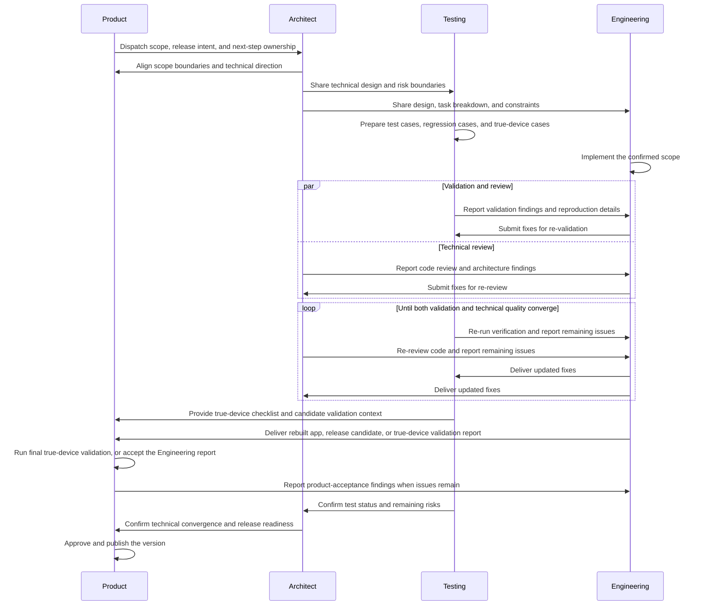

# Role Collaboration Flow

This document defines how the Product, Architect, Engineering, and Testing roles collaborate on a
MarkHola version change.

## 1. Roles

- Product — owns version scope, cross-role orchestration, and release publication
- Architect — owns technical design, technical review, and final code-quality convergence
- Engineering — owns implementation and fixes
- Testing — owns test coverage, validation design, and re-validation

## 2. Session model

Each role should operate in its own dedicated session. Do not mix multiple primary roles into the
same session when the intent is role-based collaboration.

Required session-to-role mapping:

- one Product session
- one Architect session
- one Engineering session
- one Testing session

Session names must stay explicitly associated with the role. Use role-first naming such as:

- `product`
- `architect`
- `engineering`
- `testing`

When multiple sessions of the same role are needed, keep the role prefix and add a scoped suffix,
for example:

- `architect-v1.0.0`
- `engineering-editor`
- `testing-release-v0.8.2`

The role identity of a session should remain stable throughout the work. Do not silently switch a
session from one primary role to another.

The Product session is the default coordinator for the role sessions. Product decides which role
session should act next and when work should be handed off across roles. Use the dispatch rules in
`docs/role-sessions.md` when deciding the next session.

All new cross-session IM messages must include a UUID message ID as defined in
`docs/role-sessions.md`. Role sessions should use that message ID, not only timestamp text, as the
primary key for deciding whether an IM instruction has already been handled.

If a rule or coordination notice applies to every role session, send it with `@all`. Scheduled IM
watchers should reduce from every 10 seconds to every 5 minutes after 5 minutes without any newly
appended message. As soon as a watcher reads any new appended message, it should immediately
restore to every 10 seconds and restart its 5-minute idle countdown from that message-receipt
time.

When Product hands off a scope change, the handoff must preserve the smallest confirmed
interpretation of the user's request. Do not silently widen a feedback item from one scenario into
multiple scenarios, or from one UI surface into a whole feature, unless Product explicitly says to
broaden the change.

When the requested work changes implementation behavior, Product should hand the corrected scope to
Architect first. Product should not bypass Architect and directly instruct Engineering on product
scope corrections, unless Architect has already confirmed the same implementation boundaries and
Product is only restating them to remove ambiguity.

When any role is blocked on a pending scope confirmation that is required before the next stage can
continue, that role should proactively follow up instead of waiting indefinitely. As a default
workflow rule, send one reminder after 10 minutes without a reply, then continue at a low reminder
frequency until the blocked confirmation is resolved or the task direction changes.

When any role already has a clear next owner, next action, and no unresolved blocker, that role
should continue the workflow immediately instead of stopping after only acknowledging the message.
Do not treat a pure receipt reply as sufficient progress when review, implementation, validation,
handoff, or acceptance work is already ready to continue.

When a role is running a bounded submission-readiness or release-preparation pass, it should try to
complete that pass before reporting back, then return one consolidated blocker summary instead of
multiple fragmented blocker messages whenever practical.

Before any role appends a coordination IM, it should first re-check the latest IM state; after the
append, it should immediately re-check again to decide whether a newly arrived message now makes
the next step clear enough to continue without waiting for the next poll cycle.

Role details live in:

- `docs/roles/product.md`
- `docs/roles/architect.md`
- `docs/roles/engineering.md`
- `docs/roles/testing.md`
- `docs/role-sessions.md`

## 3. Sequence overview

## 4. Standard flow

### Step 1 — Product plans the version

The Product role defines the version goal, priority, and scope in `PLAN.MD`, then hands the
version task to the Architect.

### Step 2 — Product and Architect align on the solution direction

The Architect reviews the requested scope with Product, identifies technical constraints, and
prepares the technical design document.

If Product, Architect, Engineering, or Testing is waiting on a confirmation that blocks the next
step in this sequence, the waiting role should re-ping the owner of that confirmation rather than
stalling silently.

### Step 3 — Testing prepares validation coverage

Testing waits for the Architect handoff, then uses the version plan and the technical design
document to prepare the testing design and validation coverage:

- test-plan design
- test cases
- regression coverage
- true-device validation cases
- release-relevant verification cases when applicable

Product also provides important-scenario UX expectations and key-scenario HTML design direction
when the change needs explicit HTML prototype or brand guidance.

### Step 4 — Engineering implements the work

Engineering starts implementation according to the approved technical design and keeps the work
within the confirmed version scope.

### Step 5 — Architect reviews the implementation direction

As implementation becomes available, the Architect reviews code quality and gives improvement
feedback on:

- architecture layering
- module structure
- design patterns
- extensibility
- performance
- compatibility

If the review input is already sufficient, the Architect should continue the review directly rather
than pausing at an acknowledgment-only reply.

### Step 6 — Testing validates the delivered behavior

Once the implementation is functionally ready, Testing executes the planned validation and reports
issues with enough detail for reproduction.

If the delivered candidate and validation target are already clear, Testing should continue with
validation or checklist preparation directly rather than stopping at receipt-only confirmation.

### Step 7 — Engineering fixes issues and resubmits

Engineering addresses both:

- defects reported by Testing
- technical review findings from the Architect

Then Engineering resubmits the updated result.

If the required fix scope is already clear, Engineering should continue implementation directly
instead of stopping after an acknowledgment-only IM reply.

### Step 8 — Testing and Architect converge in parallel

Testing re-runs verification while the Architect re-reviews the updated code. This loop continues
until both of these are true:

- the tested behavior is acceptable
- the technical structure is acceptable

### Step 9 — True-device validation

When required by the change, Product owns the final decision on true-device acceptance for the
packaged or rebuilt application. Testing prepares the cases, evidence checkpoints, and focused
re-validation targets, and Engineering provides the rebuilt app or release candidate plus any
implementation notes needed for efficient checking. If Engineering has already submitted a
sufficient true-device validation report for the current candidate, Product may accept that report
directly instead of rerunning the same checks. Any findings return to Engineering for fixes, then
back through Testing and Architect review again.

### Step 10 — Architect prepares final technical acceptance

After Testing and review findings have converged, the Architect confirms the code is ready for
submission quality and release-candidate preparation.

During submission-readiness checks, the Architect should batch closely related repository blockers
into one report when they are discoverable within the same check pass, so Product can resolve them
with fewer coordination turns.

### Step 11 — Product publishes the version

After technical and validation acceptance is complete, the Product role makes the final release
decision and publishes the new software version.

## 5. Iteration rule

The flow is intentionally iterative. After implementation starts, these three roles may cycle
multiple times:

- Engineering
- Testing
- Architect

The cycle ends only when both validation quality and technical quality have converged.

## 6. Handoff summary

### Product → Architect

Handoff items:

- target version
- confirmed scope
- priority and release intent
- one explicit `Scope in` statement
- one explicit `Scope out` statement whenever nearby behavior might be confused as affected

Interpretation rule:

- if a user comment can be read as either a local adjustment or a feature-wide decision, Product
  must hand it off as the local adjustment unless broader scope is explicitly confirmed
- if the correction affects implementation behavior, Product should treat Architect as the default
  next owner before Engineering receives a new implementation instruction

### Architect → Testing

Handoff items:

- technical design document
- expected behavior boundaries
- identified risks and special cases

### Architect → Engineering

Handoff items:

- technical design
- task breakdown
- implementation constraints

### Testing → Engineering

Handoff items:

- validation failures
- reproduction details
- regression findings

### Testing → Product

Handoff items:

- true-device checklist
- important evidence checkpoints
- focused re-validation targets after implementation changes

### Engineering → Product

Handoff items:

- rebuilt app or release candidate
- implementation notes needed for focused checking
- true-device validation report when Product asks Engineering to cover that part of acceptance

### Architect → Engineering

Follow-up items:

- code review findings
- architecture improvements
- extensibility or performance concerns

### Architect → Product

Final status:

- technical convergence result
- remaining risk summary, if any
- submission readiness confirmation

## 7. Exit criteria by stage

### Planning exits when

- version scope is clear
- technical design direction is accepted
- testing coverage direction is defined

### Implementation exits when

- Engineering has completed the intended scope
- Architect review findings are addressed or explicitly accepted
- Testing findings are addressed or explicitly accepted

### Release preparation exits when

- true-device validation is complete where required
- code quality is accepted by the Architect
- Product decides to publish

## 8. Workflow ownership by role

The repository contains several workflow rules that belong to different roles. Use this ownership
split when deciding who should drive each part of the process.

### Product owns

- version planning
- cross-role session orchestration
- feature placement into `PLAN.MD`
- scope confirmation
- important-scenario user experience and HTML design direction
- final true-device product acceptance
- final release publication decision

### Architect owns

- technical design
- implementation task decomposition
- architecture and maintainability review
- final technical convergence before submission quality

### Engineering owns

- feature implementation
- incremental code changes
- local validation of affected code paths
- commit preparation for implementation work

### Testing owns

- test-case preparation
- regression planning
- true-device validation design and support
- release-candidate validation evidence

## 9. Special repository flows

### Feature implementation flow

- Product confirms version scope
- Architect defines technical design
- Testing defines test coverage
- Engineering implements
- Testing validates
- Architect reviews
- Engineering fixes
- Testing and Architect re-check until convergence

### Git submission flow

- Engineering prepares submission-ready change sets
- Architect verifies the code has reached submission quality
- Product dispatches the Git-submission step to Architect
- Architect performs the final Git commit with accurate grouping and commit messaging

### Release flow

- Engineering prepares the release candidate build
- Testing validates the exact candidate artifact and prepares true-device validation support
- Architect confirms technical convergence and release readiness
- Product runs final true-device acceptance
- Product makes the final publish decision
