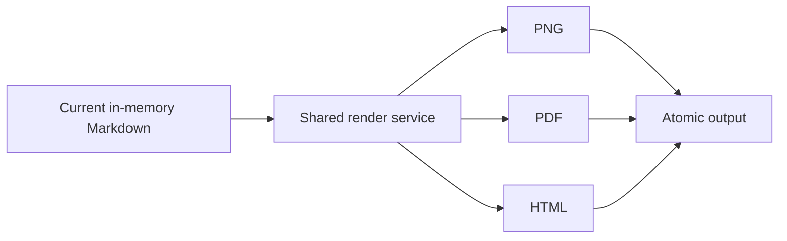

# MarkHola v0.9.1 Export and Save As Verification

Use this tracked example to verify full-document PNG export, PDF and HTML parity, rendered
Markdown resources, and Save As source preservation.

> Do not edit or save this canonical file during verification. Copy this file and the
> `assets/` directory to a disposable workspace first. Run edit, Save, Save As, and export checks
> only against that copy. The Git hashes of this canonical file and `examples/assets/diagram.svg`
> must remain unchanged.

## Verification workflow

1. Copy `examples/v0.9.1-png-export-and-save-as.md` and `examples/assets/` into a disposable
   directory while preserving their relative layout.
2. Open the copied Markdown file in MarkHola.
3. Review it in both Light and Dark themes.
4. Export the full document as PNG, PDF, and HTML.
5. Confirm that all three outputs contain the current in-memory content, including an unsaved
   temporary edit made only in the disposable copy.
6. Use Save As on the disposable copy and confirm that the original copied source remains
   unchanged while the new Markdown file receives the edited content.
7. Reopen the Save As result and confirm that its Markdown source and rendered output agree.
8. Confirm with `git diff -- examples/` that the canonical example and asset did not change.

## Visual style checks

The table header should use the restrained green theme surface, with square corners. Links use the
theme accent without an underline, while ordinary text remains comfortable to read.

| Surface | Light expectation | Dark expectation |
| --- | --- | --- |
| Document | Very light green reading surface | Soft dark neutral surface |
| Table header | Restrained green tint | Dark green-tinted header with readable text |
| Code | Low-stimulation neutral palette | Soft deep gray-purple palette |
| Divider | Violet leading edge with a subtle fade | Visible violet fade without glare |

---

The divider above must read as a separator rather than an interactive control.

## Local image

The relative SVG below must render in the app and remain visible in PNG, PDF, and standalone HTML.


## Mermaid



The flowchart should be fully rendered, not replaced by source text or a loading placeholder.

## Mathematics

Inline math should render within this sentence: $E = mc^2$.

Display math should be centered and complete:

$$
\int_0^1 x^2 \, dx = \frac{1}{3}
$$

## Syntax highlighting

```rust
#[derive(Debug)]
struct ExportResult {
    format: &'static str,
    bytes: usize,
    complete: bool,
}

fn verify(result: &ExportResult) -> bool {
    result.complete && result.bytes > 0
}
```

```javascript
const outputs = ["png", "pdf", "html"];
const complete = outputs.every((format) => format.length > 0);
console.log({ outputs, complete });
```

The code surface, line-number gutter, language label, keywords, strings, and comments should remain
readable without excessive contrast in both themes.

## Long full-document output

This section intentionally extends beyond a typical viewport. PNG export must capture the complete
rendered document rather than only the visible screen or a clipped bitmap.

### Stage 1 — Source identity

- Open the disposable copy by its absolute path.
- Confirm the expected document ID, version, path, and content identity.
- Keep the canonical tracked source untouched.

### Stage 2 — Current-memory edit

- Switch the disposable document to Edit mode.
- Add a short marker such as `temporary export verification`.
- Do not save before the first export.
- Confirm PNG, PDF, and HTML include the temporary marker.

### Stage 3 — Render readiness

- Return to Readonly mode.
- Wait for Markdown, code, Mermaid, math, and the local SVG to finish rendering.
- Treat a missing image, placeholder, clipped diagram, or raw formula as a failure.

### Stage 4 — PNG

- Choose `File > Export > PNG`.
- Confirm the suggested filename ends in `.png`.
- Confirm cancellation creates no output.
- Export again and confirm the image includes content from the title through the final checklist.

### Stage 5 — PDF

- Choose `File > Export > PDF`.
- Confirm every page is non-empty and the final section is not clipped.
- Compare headings, code, table, Mermaid, math, and the local image with PNG.

### Stage 6 — HTML

- Choose `File > Export > HTML`.
- Open the exported file independently.
- Confirm the content and local resource rendering agree with PNG and PDF.

### Stage 7 — Save As

- Record the disposable source hash before Save As.
- Save to a different absolute `.md` or `.markdown` path.
- Confirm the old source hash is unchanged.
- Confirm the new file contains the current full Markdown source.
- Reopen the new path and repeat a bounded render check.

## Repeated content for height coverage

1. A full-document export includes content above and below the initial viewport.
2. A full-document export includes tables without rounded corners.
3. A full-document export includes the theme divider.
4. A full-document export includes the relative SVG.
5. A full-document export includes Mermaid output.
6. A full-document export includes inline and display math.
7. A full-document export includes highlighted code and line numbers.
8. A full-document export includes unsaved current-memory content.
9. A cancelled export leaves no final or temporary artifact.
10. A successful export reports the final path and produces a valid format.

### Additional height block A

MarkHola should preserve paragraph spacing, line wrapping, and comfortable contrast across a long
reading surface. The PNG should not stop at this paragraph.

### Additional height block B

MarkHola should preserve the same document ordering in PNG, PDF, HTML, and the app preview. The PNG
should not stop at this paragraph either.

### Additional height block C

The final export should include this text, the checklist below, and the final divider.

## Final checklist

- [ ] Tested from a disposable copy with the relative `assets/` directory
- [ ] Light theme reviewed
- [ ] Dark theme reviewed
- [ ] PNG contains the full document
- [ ] PDF and HTML match the same rendered content
- [ ] Mermaid, math, code, table, divider, and local SVG are present
- [ ] Unsaved current-memory marker appears in all exports
- [ ] Cancelled export leaves no artifact
- [ ] Save As preserves the original copied source
- [ ] Reopened Save As result matches its Markdown source
- [ ] Canonical example and asset hashes remain unchanged

---

End of the v0.9.1 full-document export fixture.
