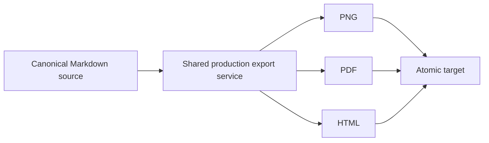

# MarkHola v0.9.2 Offline CLI Export

This tracked example verifies one-shot PNG, PDF, and HTML export through the MarkHola application
binary without opening the normal application workspace.

> Do not run overwrite or mutation checks against this canonical file. Copy this file and the
> `assets/` directory to a disposable workspace first. Record the canonical hashes before testing
> and confirm they remain unchanged afterward.

## Prepare a disposable workspace

```bash
mkdir -p /private/tmp/markhola-v092-cli/assets
cp /absolute/path/to/markhola/examples/v0.9.2-offline-cli-export.md \
  /private/tmp/markhola-v092-cli/source.md
cp /absolute/path/to/markhola/examples/assets/diagram.svg \
  /private/tmp/markhola-v092-cli/assets/diagram.svg
```

Use the executable inside the exact candidate being tested:

```bash
MARKHOLA_BIN="/absolute/path/to/MarkHola.app/Contents/MacOS/MarkHola"
SOURCE="/private/tmp/markhola-v092-cli/source.md"
```

All paths passed to the CLI must be absolute, normalized, and canonical.

## Public commands

```bash
"$MARKHOLA_BIN" version
"$MARKHOLA_BIN" help

"$MARKHOLA_BIN" export-png \
  --source="$SOURCE" \
  --target=/private/tmp/markhola-v092-cli/light.png \
  --theme=light \
  --json

"$MARKHOLA_BIN" export-pdf \
  --source="$SOURCE" \
  --target=/private/tmp/markhola-v092-cli/dark.pdf \
  --theme=dark \
  --json

"$MARKHOLA_BIN" export-html \
  --source="$SOURCE" \
  --target=/private/tmp/markhola-v092-cli/light.html \
  --theme=light \
  --json
```

The default theme is Light, which maps internally to the canonical `default` theme key. Dark must
be selected explicitly with `--theme=dark`. The first release does not accept `system`.

Existing targets must fail without modification unless `--overwrite` is explicitly supplied:

```bash
"$MARKHOLA_BIN" export-html \
  --source="$SOURCE" \
  --target=/private/tmp/markhola-v092-cli/light.html

"$MARKHOLA_BIN" export-html \
  --source="$SOURCE" \
  --target=/private/tmp/markhola-v092-cli/light.html \
  --overwrite
```

## Source preservation

Record the disposable source hash before and after every command:

```bash
shasum -a 256 "$SOURCE"
```

The hashes must remain identical. A successful command must report the canonical target path,
output size, SHA-256, format, `success: true`, and `schema_version: 1`. A failed JSON command must
emit one response object on stdout, an English diagnostic on stderr, and one of the documented
stable exit codes.

| Exit | Meaning |
| ---: | --- |
| 0 | Success |
| 2 | Invalid command, option, or schema |
| 3 | Invalid or unreadable source |
| 4 | Unsafe, unavailable, or conflicting target |
| 5 | Render or export failure |
| 6 | Resource limit or timeout |
| 7 | Internal or hidden-runtime initialization/cleanup failure |

## Theme and table parity

The table, divider, ordinary text, and links should match MarkHola's Light and Dark reading
surfaces. Links remain free of underlines.

| Surface | Light | Dark |
| --- | --- | --- |
| Page | Very light green-neutral | Soft dark neutral |
| Table header | Restrained green | Dark green with readable text |
| Code | Low-stimulation gray-purple | Soft deep gray-purple |
| Divider | Violet fade | Visible without glare |

---

## Relative local image

The local SVG must resolve relative to the copied source in all three formats.


## Mermaid



The result must contain a rendered diagram rather than raw Mermaid source or a loading state.

## Mathematics

Inline math remains readable: $E = mc^2$.

Display math must be complete:

$$
\int_0^1 x^2 \, dx = \frac{1}{3}
$$

## Syntax highlighting

```rust
struct OfflineExport {
    source_is_unchanged: bool,
    output_is_atomic: bool,
    visible_window_count: usize,
}

fn accepted(result: &OfflineExport) -> bool {
    result.source_is_unchanged
        && result.output_is_atomic
        && result.visible_window_count == 0
}
```

## Long-document coverage

The PNG must include every numbered item below rather than stopping at the initial viewport.

1. The process executes exactly one command.
2. No normal MarkHola window becomes visible.
3. No native file panel opens.
4. The process does not take keyboard focus.
5. No v0.9.1 Unix socket endpoint is created.
6. The source stays byte-for-byte unchanged.
7. The local SVG is resolved from the source directory.
8. Mermaid and math finish rendering.
9. Light and Dark produce visibly different, readable surfaces.
10. PNG captures the complete rendered document.
11. PDF pages are non-empty and unclipped.
12. Standalone HTML renders without the MarkHola workspace shell.
13. Existing output is preserved when overwrite is false.
14. `--overwrite` replaces only the requested target.
15. Failed export leaves no temporary or partial artifact.

### Height block A

This paragraph must appear below the initial PNG viewport. It verifies that line wrapping and
vertical spacing remain comfortable across the full Light and Dark surfaces.

### Height block B

This paragraph must appear after the Mermaid, math, image, table, divider, and code sections in
PNG, PDF, and HTML.

### Height block C

This final content block and the checklist below must remain present and readable.

## Final checklist

- [ ] Tested an exact packaged app binary
- [ ] Used a disposable copy and relative `assets/` directory
- [ ] Verified `version` reports `0.9.2`
- [ ] Verified public help does not mention internal smoke commands
- [ ] Verified Light and Dark PNG, PDF, and HTML
- [ ] Verified full-height PNG output
- [ ] Verified Mermaid, math, local SVG, table, divider, and code
- [ ] Verified source hash preservation
- [ ] Verified overwrite protection and explicit overwrite
- [ ] Verified JSON schema and stable exit codes
- [ ] Verified no visible window, focus change, file panel, or resident process
- [ ] Verified canonical tracked example and SVG hashes remain unchanged

---

End of the v0.9.2 offline CLI fixture.
