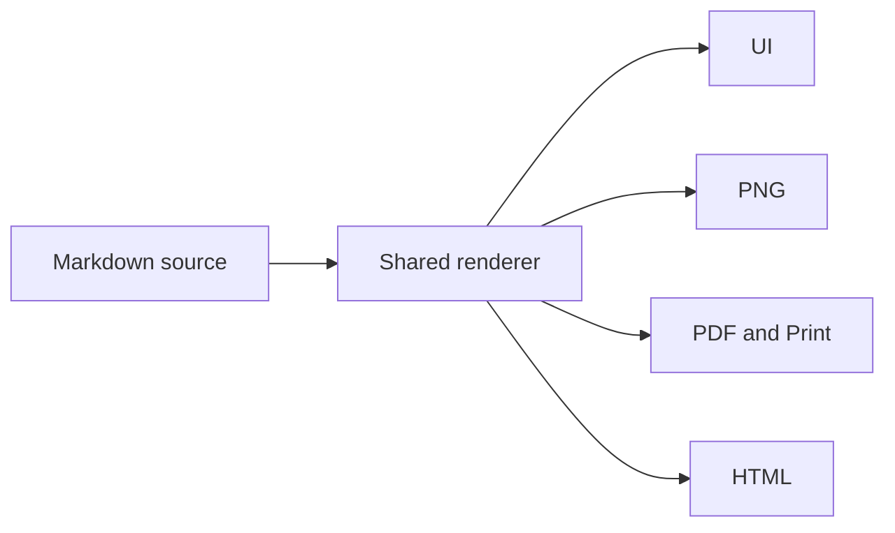

# MarkHola v0.9.3 Reading and Markdown

This canonical example verifies document sizing, wide tables, printing, and shared footnotes. Do
not edit or save this tracked file during validation.

## Disposable verification workspace

Copy this file and the shared assets before any writable-mode or Save As checks:

```bash
mkdir -p /tmp/markhola-v093/examples/assets
cp examples/v0.9.3-reading-and-markdown.md /tmp/markhola-v093/examples/
cp examples/assets/diagram.svg /tmp/markhola-v093/examples/assets/
```

Record the canonical hashes before testing and confirm they remain unchanged afterward:

```bash
git hash-object examples/v0.9.3-reading-and-markdown.md examples/assets/diagram.svg
```

## Document size and Print

1. Open the disposable copy in MarkHola.
2. Use `Command + +` and `Command + -`; verify 10% steps and the 50%/200% limits.
3. Switch tabs and reopen MarkHola; verify the selected document size persists.
4. At 50%, 100%, and 200%, open `File > Print` and verify the Print surface snapshots the current
   document size without inheriting pinch zoom.
5. Confirm headings, code, the table, Math, Mermaid, the local image, and footnotes remain complete.

## Wide table

Tab to the accessible `Scrollable table` region. ArrowLeft and ArrowRight must scroll only this
table; links inside cells retain their native keyboard behavior. Light and Dark show neutral zebra
rows and pointer hover, while PNG/PDF/Print retain stable zebra rows without hover capture.

| Edge | Platform | Render surface | Keyboard behavior | Light expectation | Dark expectation | Static export | Edge |
| --- | --- | --- | --- | --- | --- | --- | --- |
| LEFT-EDGE | Apple Silicon | 960 px reading surface | ArrowRight moves within this region | Neutral gray zebra row with readable text | Soft dark-gray zebra row with readable text | Complete table, no scrollbar or hover | RIGHT-EDGE |
| LEFT-EDGE-2 | Intel | 848 px static content box | ArrowLeft returns to the start | Restrained Green Tint header | Restrained Green Tint header | Deterministic table-only fit at 75% or above | RIGHT-EDGE-2 |
| LEFT-EDGE-3 | Shared HTML | [MarkHola link](https://github.com/huimang/markhola) | Link arrows remain native | Violet focus outline | Violet focus outline | Stable `table_too_wide` failure below 75% | RIGHT-EDGE-3 |

## Shared footnotes

The first referenced definition receives number one even when it is defined later.[^later] A
second reference to the same definition reuses that number and receives its own backlink.[^later]
Another definition receives the next number.[^details]

Footnotes support safe inline content such as **emphasis**, `code`, Math $E = mc^2$, lists, and a
local image. Only referenced definitions appear in the final footnote region.




## Long-output tail

Repeat the Print and PNG/PDF/HTML checks after scrolling away from the footnote region. Every output
must include the complete definitions and backlinks at the document end, independent of the current
UI scroll position. The final page must not be empty, clipped, or missing its footer.

### Continuation A

MarkHola preserves the source Markdown while the shared renderer prepares accessible output. This
paragraph provides vertical distance so the footnote region participates in full-height measurement.

### Continuation B

At 200%, verify that pagination expands naturally. At 50%, verify that text remains legible and the
wide table behavior stays table-scoped. Pinch zoom must not alter Print or export sizing.

[^details]: Details can contain **strong text**, `inline code`, Math $x^2 + y^2 = z^2$, and a list:

    - Shared by UI and standalone HTML.
    - Included completely in PNG, PDF, and Print.

    

[^later]: This definition appears after `details` in the source but is numbered first because its
    reference appears first. Its two references must have distinct, keyboard-accessible backlinks.

[^unused]: This definition is intentionally unreferenced and must not render.

End of the v0.9.3 reading and Markdown fixture.
