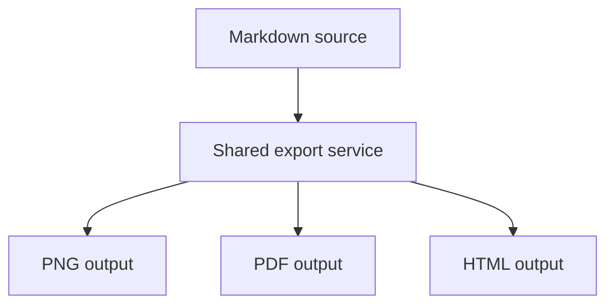

# Offline CLI Export Fixture

This disposable fixture covers the accepted v0.9.2 offline export CLI scope.

## Theme

The Light theme must map to the internal `default` export service theme key.
The Dark theme must keep the same document content while changing only theme output.

## Mermaid

## Math

Inline math stays available: $E = mc^2$.

Display math stays available:

$$
\int_0^1 x^2 dx = \frac{1}{3}
$$

## Local Asset

## Long Content

1. The command must run once and exit.
2. The source file must remain unchanged.
3. The target file must be written atomically.
4. Hidden smoke flags must stay private.
5. No visible window or focus change is allowed.

Paragraph 1: this fixture is intentionally long enough to exercise multi-section export rendering.

Paragraph 2: the CLI must share the exact production export service used by the UI and socket flows.

Paragraph 3: local assets resolve relative to the canonical source path, not the current working directory.

Paragraph 4: JSON output belongs on stdout only when `--json` is explicitly requested.

Paragraph 5: diagnostics belong on stderr and must not leak unrelated local content.
